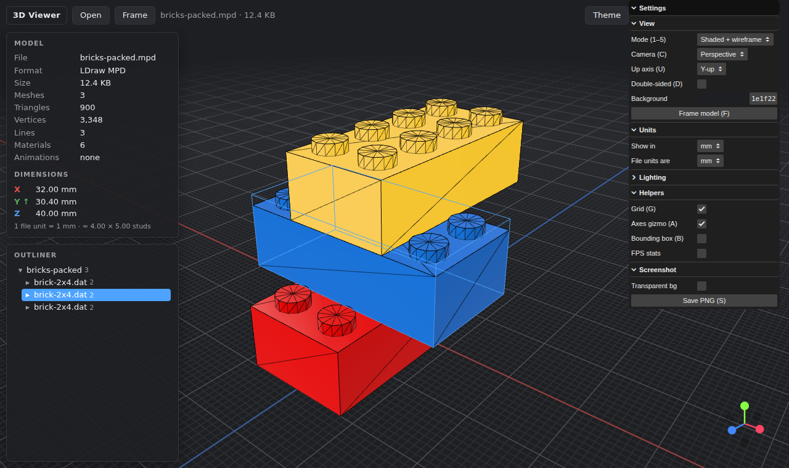

# Local 3D Viewer

A fast, offline-first 3D model viewer that runs in your browser: a personal replacement
for the discontinued **Microsoft 3D Viewer**. Drop in a file and inspect it. It handles
3D-printing formats, DCC interchange formats, CAD (STEP/IGES/Rhino), point clouds and
LEGO LDraw models.

Built with [Vite](https://vite.dev) and [three.js](https://threejs.org) in plain modern
JavaScript (no framework, no TypeScript), so it's easy to read and extend.
Everything (decoders and WASM included) is bundled locally, so no internet is needed after `npm install`.



## Features

- **Drag and drop** anywhere (files or whole folders) or use **Open**. Multi-file drops such as
  `.obj` + `.mtl` + textures or `.gltf` + `.bin` + textures resolve by filename
  (case-insensitive, folder paths ignored). Missing textures are reported.
- **Auto-framing**: the model is centred, sits on the grid and fills the view. Press **F** to re-frame.
- **Y-up / Z-up** toggle, with per-format defaults (Z-up for STL, 3MF, AMF, G-code and 3DM).
- **Perspective / orthographic** camera, damped orbit controls, PBR lighting (room environment
  + adjustable key light).
- **Inspection**: file info, mesh / triangle / vertex / material counts, animations,
  and **bounding-box dimensions** in mm / cm / m / inch or raw file units. An
  "assume file units are…" setting defaults to mm for STL/3MF, cm for FBX and m for glTF.
  LDraw models also show their footprint in studs.
- **View modes**: shaded, wireframe, shaded + wireframe, normals, clay.
- **Toggles**: grid, axes gizmo, bounding box, double-sided, background colour, light/dark theme.
- **Outliner**: collapsible scene hierarchy. Click a node to highlight it, double-click to frame it.
- **Animation**: plays the first clip, with a clip picker and play/pause.
- **G-code**: toolpath preview with a layer slider and optional travel moves.
- **Screenshot** to PNG, optionally with a transparent background.

## Supported formats

| Extension(s) | Loader / library | Notes |
|---|---|---|
| `.stl` | STLLoader | Binary + ASCII, neutral grey material, per-face colours if present |
| `.3mf` | 3MFLoader | Colours/materials from the file |
| `.amf` | AMFLoader | |
| `.gcode` `.gco` | GCodeLoader | Layer slider, travel moves toggle |
| `.obj` (+ `.mtl`) | OBJLoader, MTLLoader | MTL used when dropped together |
| `.gltf` `.glb` | GLTFLoader | Draco, KTX2/Basis and Meshopt compression supported |
| `.fbx` | FBXLoader | Animations |
| `.dae` | ColladaLoader | Animations, `<unit>` and Z_UP handled by the loader |
| `.3ds` | TDSLoader | |
| `.usdz` `.usda` `.usdc` `.usd` | USDLoader | (three's `USDZLoader` is deprecated; `USDLoader` covers all) |
| `.ply` | PLYLoader | Meshes or point clouds, vertex colours |
| `.pcd` | PCDLoader | Point cloud |
| `.xyz` | XYZLoader | Point cloud (`x y z [r g b]`) |
| `.vtk` `.vtp` | VTKLoader | Deprecated upstream (removal planned for three r194) |
| `.step` `.stp` `.iges` `.igs` | occt-import-js (OpenCASCADE WASM) | Runs in a Web Worker; assembly tree and per-face colours |
| `.3dm` | 3DMLoader + rhino3dm (WASM) | Reads the Rhino document unit |
| `.ldr` `.mpd` `.dat` | LDrawLoader | See [LDraw setup](#ldraw-setup) |

**Not supported** (proprietary): `.ma` `.mb` `.max` `.c4d` `.skp` `.blend` `.sldprt` `.f3d` and a few more.
Dropping one shows which format to export instead (e.g. *"Export as FBX or glTF from Maya"*).

## Setup

Requires [Node.js](https://nodejs.org) 20.19+ or 22.12+.

```bash
npm install
npm run dev        # http://localhost:5173
```

Other scripts:

| Command | |
|---|---|
| `npm run build` | Production build into `dist/` |
| `npm run preview` | Serve the production build at http://localhost:4173 |
| `npm run samples` | Regenerate the test models in `samples/` |

The `samples/` folder has small test files for STL (binary + ASCII), OBJ + MTL, an animated GLB,
a vertex-coloured PLY, an XYZ point cloud, LDraw `.ldr` / packed `.mpd` and a G-code vase.

## Windows desktop app (.exe)

The app can be packaged as a native Windows program with [Tauri](https://tauri.app). It uses the
WebView2 runtime built into Windows 10/11, so the app is only a few MB.

**Easiest: let GitHub build it.** Every push to `main` or a pull request runs the
[Windows build](.github/workflows/windows-build.yml) workflow. Open the repo's **Actions** tab,
pick the latest *Windows build* run and download the **local-3d-viewer-windows** artifact. It
contains:
- `local-3d-viewer.exe`: the portable app, which runs without installing
- `Local 3D Viewer_x.y.z_x64-setup.exe`: an installer with a Start-menu shortcut and uninstaller
- `Local 3D Viewer_x.y.z_x64_en-US.msi`: an MSI installer

You can also start it by hand with **Run workflow**.

**Build locally** (on Windows) after installing
[Visual Studio Build Tools](https://visualstudio.microsoft.com/visual-cpp-build-tools/)
("Desktop development with C++") and [Rust](https://rustup.rs):

```powershell
npm run tauri:dev     # desktop window with hot reload
npm run tauri:build   # → src-tauri\target\release\ (+ bundle\nsis, bundle\msi)
```

Notes:
- The build is unsigned, so Windows SmartScreen may say "Windows protected your PC".
  Click **More info → Run anyway**.
- The LDraw parts library isn't available in the desktop app yet, because `/ldraw/` is served by
  the Vite dev server. Packed `.mpd` files and the built-in colours still work.

## LDraw setup

`.ldr` / `.mpd` files normally reference parts from the **LDraw parts library**, which is
large and has its own licence, so it is **not** included in this repo.

1. Get the library, either from [library.ldraw.org](https://library.ldraw.org/updates?latest)
   (`complete.zip`, unzip it anywhere) or from the copy BrickLink Studio installs
   (e.g. `C:\Program Files\Studio 2.0\ldraw`).
2. Create a file named `.env` in the project root (it is git-ignored) that points at the folder containing `LDConfig.ldr`:
   ```ini
   LDRAW_LIBRARY_PATH=C:/LDraw/ldraw
   ```
3. Restart `npm run dev`. The console prints `[ldraw] Serving LDraw library from …`.

The dev and preview servers then serve the library at `/ldraw/`, and colours come from the
official `LDConfig.ldr`.

Without a library:
- **Packed `.mpd` files** (every part embedded in the file) still load.
- Colours fall back to a built-in approximation of common LEGO colours.
- You can drop missing `.dat` parts together with the model.

Models are flipped the right way up (LDraw is −Y up) and scaled to millimetres (1 LDU = 0.4 mm).

## Keyboard shortcuts

| Key | Action |
|---|---|
| **O** | Open file(s) |
| **F** | Frame model (or the outliner selection) |
| **1**–**5** | Shaded / wireframe / shaded + wireframe / normals / clay |
| **C** | Toggle perspective / orthographic |
| **U** | Toggle Y-up / Z-up |
| **G** | Grid |
| **A** | Axes gizmo (click an axis bubble to snap the view) |
| **B** | Bounding box |
| **D** | Double-sided |
| **S** | Save screenshot (PNG) |
| **Space** | Play / pause animation |
| **L** | Light / dark theme |
| **H** | Hide / show panels |
| **Esc** | Clear outliner selection |

Mouse: left-drag to orbit, right-drag (or Shift + left) to pan, wheel to zoom toward the cursor.

## Project structure

```
src/main.js            wires everything together, keyboard shortcuts
src/viewer/            Viewer (scene, cameras, controls, framing), helpers, view modes, stats
src/loaders/           registry.js (extension → loader, file resolution) + one file per format family
src/ui/                drop zone, overlays/toasts, lil-gui panel, info panel, outliner
src/utils/             unit conversion, GPU resource disposal
vite-plugins/          serve the LDraw library and rhino3dm WASM
src-tauri/             Tauri desktop shell (Rust) + app config and icons
scripts/make-samples.mjs
```

See [CLAUDE.md](CLAUDE.md) for conventions and how to add a format.

## Roadmap

- [x] Package as a Windows desktop app with **Tauri** (built by GitHub Actions)
- [ ] Windows file associations so double-clicking
      `.stl` / `.glb` / `.3mf` opens the viewer
- [ ] Open a file from command-line args; recent-files list
- [ ] Measure tool (click two points → distance) and a section/clipping plane
- [ ] Material/texture inspector and a UV checker view
- [ ] Export/convert (e.g. OBJ → GLB, anything → STL) with three.js exporters
- [ ] Load several STLs at once as one build plate
- [ ] Replace `VTKLoader` before three r194 removes it

## License

[MIT](LICENSE). Third-party libraries keep their own licences: three.js (MIT), lil-gui (MIT),
rhino3dm (MIT) and occt-import-js (LGPL-2.1, used unmodified as a separate WASM module).
